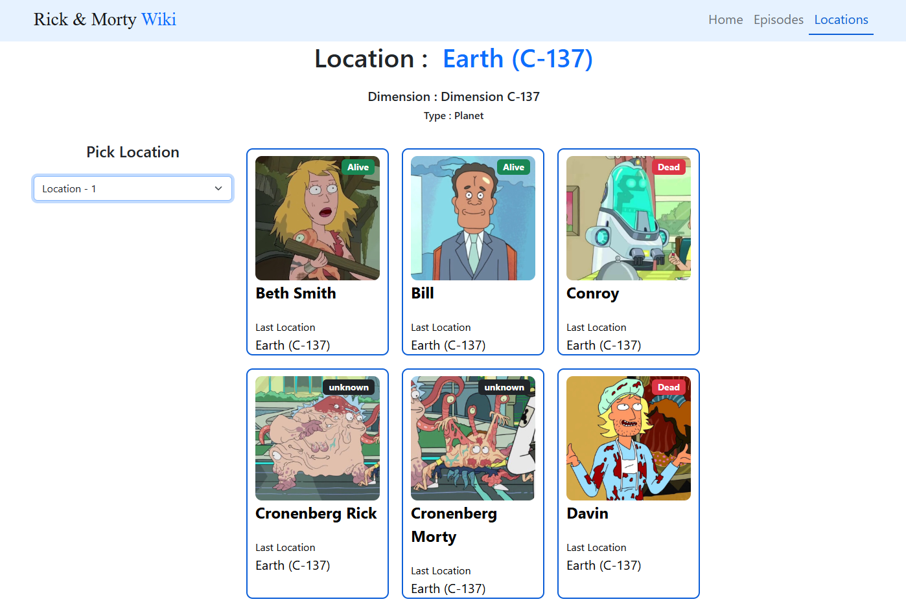

# Rick-Morty_Wiki
An wiki which uses rick and morty api to display the information of rick and morty characters.



## Technology Used
1. HTML/CSS
2. React
3. React Pagination
4. SASS
5. API - https://rickandmortyapi.com/

### Features
1. Preview characters
2. Get details about Episode which they appear, type and location
3. Filter based no various character traits

## How to Run the Project

1. Install dependencies
```
npm install
```
2. Start the development server
```
npm start
```
3. Open your browser and navigate to http://localhost:3000 to view the app.
